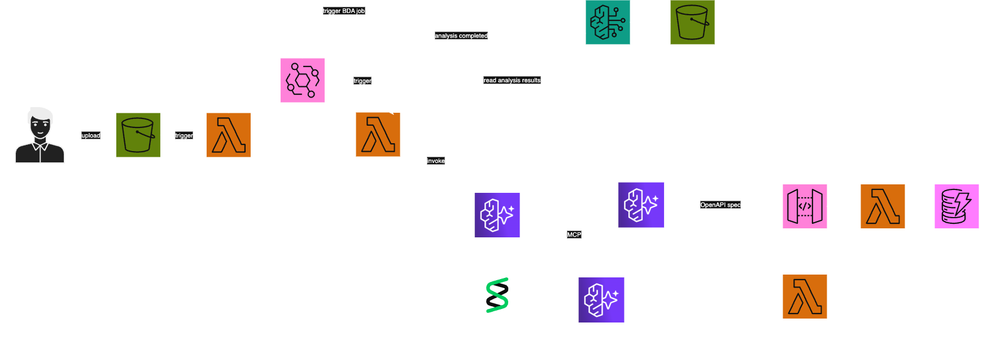

# Mortgage Application Processing with Multi-Agent Collaboration

> Intelligent document processing system leveraging Amazon Bedrock's multi-agent capabilities for automated mortgage application analysis

[](https://www.python.org/downloads/)
[](https://www.terraform.io/)
[](https://aws.amazon.com/bedrock/)
[](LICENSE)

## What This Does

This system transforms manual mortgage application processing into an automated, intelligent workflow. Upload a mortgage document, and watch as multiple AI agents collaborate to:

- Extract applicant information and financial details
- Validate document completeness and accuracy  
- Generate structured analysis reports
- Store processed data for downstream systems

**Key Benefits:**
- Reduces processing time from hours to minutes
- Eliminates manual data entry errors
- Provides consistent document analysis
- Scales automatically with demand

## Architecture



The system uses a multi-agent architecture where specialized agents handle different aspects of document processing:

| Component | Purpose |
|-----------|---------|
| **Amazon Bedrock AgentCore** | Orchestrates agent collaboration and workflow |
| **Document Extraction Agent** | Parses PDFs and extracts structured data |
| **Validation Agent** | Verifies data completeness and accuracy |
| **Storage Agent** | Manages data persistence and retrieval |
| **S3 Buckets** | Raw document and processed data storage |
| **Lambda Functions** | Document preprocessing and API operations |
| **DynamoDB** | Application state and metadata storage |

## Quick Start

### Prerequisites

Ensure you have these tools installed:

```bash
# Check versions
aws --version        # AWS CLI v2+
terraform --version  # 1.13.4+
python --version     # 3.13+
docker --version     # 20.10+
uv --version         # Latest
```

### 1. Clone and Setup

```bash
git clone <repository-url>
cd mortgage-processing-system
uv sync
source .venv/bin/activate
```

### 2. Configure AWS

```bash
aws configure
# Enter your AWS credentials and region
```

### 3. Deploy Infrastructure

```bash
make terraform-apply
```

Save the output values - you'll need them for agent configuration:

```
agentcore_iam_role_name = "agentcore-dev-iam-role"
mortgage_api_url = "https://abc123.execute-api.us-east-1.amazonaws.com"
bda_s3_bucket_name = "bedrock-data-automation-store-xyz"
raw_s3_bucket_name = "raw-document-store-xyz"
```

### 4. Deploy Agents

```bash
agentcore configure --entrypoint main.py -er agentcore-dev-iam-role
agentcore launch
```

### 5. Test the System

Upload a mortgage application PDF to test:

```bash
# Upload via AWS CLI
aws s3 cp documents/sample-mortgage-app.pdf s3://raw-document-store-xyz/

# Or use the API endpoint
curl -X POST https://abc123.execute-api.us-east-1.amazonaws.com/applications \
  -H "Content-Type: application/json" \
  -d '{"document_url": "s3://raw-document-store-xyz/sample-mortgage-app.pdf"}'
```

## Usage Examples

### Processing a Document

```python
import requests

# Submit document for processing
response = requests.post(
    "https://your-api-endpoint.amazonaws.com/applications",
    json={"document_url": "s3://bucket/mortgage-app.pdf"}
)

application_id = response.json()["application_id"]
print(f"Processing started: {application_id}")
```

### Checking Processing Status

```python
# Check processing status
status_response = requests.get(
    f"https://your-api-endpoint.amazonaws.com/applications/{application_id}"
)

print(status_response.json())
```

### Retrieving Results

```python
# Get processed data
if status_response.json()["status"] == "completed":
    results = requests.get(
        f"https://your-api-endpoint.amazonaws.com/applications/{application_id}/results"
    )
    print(results.json())
```

## Local Development

### Environment Setup

```bash
# Install dependencies
uv sync

# Activate virtual environment
source .venv/bin/activate

# Set environment variables
export AWS_REGION=us-east-1
export AWS_BUCKET_NAME=your-bucket-name
export LOGGING_LEVEL=INFO
```

### Running Tests

```bash
# Run unit tests
python -m pytest tests/

# Run integration tests
python -m pytest tests/integration/

# Run with coverage
python -m pytest --cov=src tests/
```

### Local Agent Testing

```bash
# Test agents locally
agentcore launch --local

# View logs
tail -f ~/.agentcore/logs/agent.log
```

## Configuration

### Environment Variables

| Variable | Description | Default |
|----------|-------------|---------|
| `AWS_REGION` | AWS region for resources | `us-east-1` |
| `AWS_BUCKET_NAME` | S3 bucket for processed documents | Required |
| `LOGGING_LEVEL` | Application logging level | `INFO` |
| `MAX_DOCUMENT_SIZE` | Maximum document size (MB) | `10` |
| `PROCESSING_TIMEOUT` | Agent processing timeout (seconds) | `300` |

### Agent Configuration

Agents can be customized via the `.bedrock_agentcore.yaml` file:

```yaml
agents:
  extraction_agent:
    model: "anthropic.claude-3-sonnet-20240229-v1:0"
    temperature: 0.1
    max_tokens: 4000
  
  validation_agent:
    model: "anthropic.claude-3-haiku-20240307-v1:0"
    temperature: 0.0
    max_tokens: 2000
```

## Troubleshooting

### Common Issues

**Agent deployment fails:**
```bash
# Check IAM permissions
aws sts get-caller-identity
aws iam get-role --role-name agentcore-dev-iam-role
```

**Document processing timeout:**
```bash
# Check CloudWatch logs
aws logs describe-log-groups --log-group-name-prefix /aws/lambda/mortgage
```

**S3 access denied:**
```bash
# Verify bucket permissions
aws s3api get-bucket-policy --bucket your-bucket-name
```

### Getting Help

1. Check the [troubleshooting guide](docs/troubleshooting.md)
2. Review CloudWatch logs for detailed error messages
3. Ensure all prerequisites are properly installed
4. Verify AWS credentials and permissions

## Contributing

We welcome contributions! Please see our [Contributing Guide](CONTRIBUTING.md) for details.

### Development Workflow

1. Fork the repository
2. Create a feature branch: `git checkout -b feature/amazing-feature`
3. Make your changes and add tests
4. Run the test suite: `make test`
5. Commit your changes: `git commit -m 'feat: add amazing feature'`
6. Push to your branch: `git push origin feature/amazing-feature`
7. Open a Pull Request

## License

This project is licensed under the MIT License - see the [LICENSE](LICENSE) file for details.

## Acknowledgments

- Amazon Bedrock team for the multi-agent framework
- AWS samples community for infrastructure patterns
- Contributors who helped improve this system
