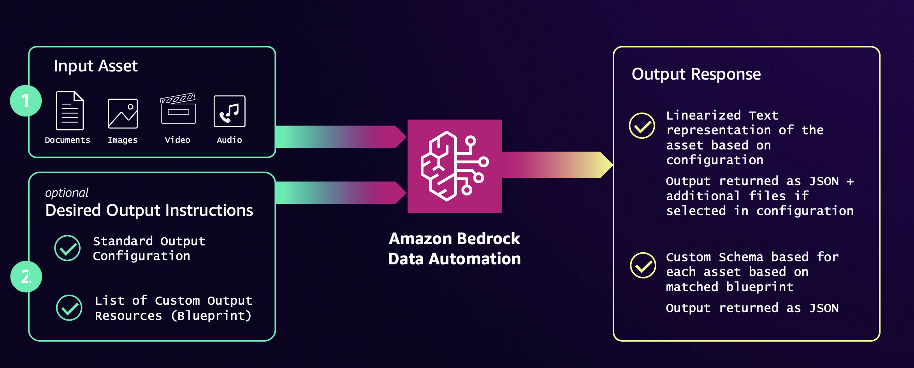

# Document Processing with Amazon Bedrock Data Automation

## How Bedrock Data Automation works

Bedrock Data Automation (BDA) lets you configure output based on your processing needs for a specific data type: documents, images, video or audio. BDA can generate standard output or custom output. Below are some key concepts for understanding how BDA works. If you're a new user, start with the information about standard output.

* **Standard output** – Sending a file to BDA with no other information returns the default standard output, which consists of commonly required information that's based on the data type. Examples include audio transcriptions, scene summaries for video, and document summaries. These outputs can be tuned to your use case using projects to modify them. For more information, see e.g. [Standard output for documents in Bedrock Data Automation](https://docs.aws.amazon.com/bedrock/latest/userguide/bda-output-documents.html).

* **Custom output** – For documents and images, only. Choose custom output to define exactly what information you want to extract using a blueprint. A blueprint consists of a list of expected fields that you want retrieved from a document or image. Each field represents a piece of information that needs to be extracted to meet your specific use case. You can create your own blueprints, or select predefined blueprints from the BDA blueprint catalog. For more information, see [Custom output and blueprints](https://docs.aws.amazon.com/bedrock/latest/userguide/bda-custom-output-idp.html).

* **Projects** – A project is a BDA resource that allows you to modify and organize output configurations. Each project can contain standard output configurations for documents, images, video, and audio, as well as custom output blueprints for documents and images. Projects are referenced in the `InvokeDataAutomationAsync` API call to instruct BDA on how to process the files. For more information about projects and their use cases, see [Bedrock Data Automation projects](https://docs.aws.amazon.com/bedrock/latest/userguide/bda-projects.html).



This workshop contains the following sections

* **1 - Understanding Bedrock Data Automation**
  * [Getting Started - How Bedrock Data Automation works](10-Understanding-BDA/11_getting_started_with_bda.ipynb)
  * [Document Insights with Standard Outputs](10-Understanding-BDA/12_standard_output_extended.ipynb)
  * [Custom Document Insights with Blueprints](10-Understanding-BDA/13_custom_outputs_and_blueprints.ipynb)
* **2 - Industry Use Cases - Document Processing**
  * [Mortgage and Lending Flow](20-Industry-Use-Cases/21-Mortgage-and-Lending/21_mortgage_and_lending.ipynb)
  * [Medical Claims Processing with Agents](20-Industry-Use-Cases/22-Medical-Claims-Processing/22_medical_claims_processing.ipynb)

* **3 - Bedrock Data Automation Patterns (Coming Soon)**

### Use Cases

Here are some example use cases that BDA can help you with - 

**Document processing**: Automate Intelligent Document Processing workflows at scale, transforming unstructured documents into structured data outputs that can be customized to integrate with existing systems and workflows.

**Media analysis**: Extract meaningful insights from unstructured video by creating scene summaries, identifying unsafe/explicit content, extracting text, and classifying content, enabling intelligent video search, contextual advertising, and brand safety/compliance.

**Generative AI assistants**: Enhance the performance of your retrieval-augmented generation (RAG) powered question answering applications by providing them with rich, modality-specific data representations extracted from your documents, images, video, and audio.

### Getting Started

* Create Jupyterlab space in Amazon Sagemaker Studio or any other environment
* Make sure you have the required IAM role permissions
* Checkout the repository
* Run through the notebooks

### Required IAM Permissions

The features being explored in the notebook require the following IAM Policies for the execution role being used. If you're running this notebook within SageMaker Studio in your own Account, update the default execution role for the SageMaker user profile to include the following IAM policies. 

When using your own AWS Account to run this workshop, use AWS regions `us-east-1` or `us-west-2` where Bedrock Data Automation is available as of this writing.

```json
  [
    {
        "Sid": "BDACreatePermissions",
        "Effect": "Allow",
        "Action": [
            "bedrock:CreateDataAutomationProject",
            "bedrock:CreateBlueprint"
        ],
        "Resource": "*"
    },
    {
        "Sid": "BDAOProjectsPermissions",
        "Effect": "Allow",
        "Action": [
            "bedrock:CreateDataAutomationProject",
            "bedrock:UpdateDataAutomationProject",
            "bedrock:GetDataAutomationProject",
            "bedrock:GetDataAutomationStatus",
            "bedrock:ListDataAutomationProjects",
            "bedrock:InvokeDataAutomationAsync"
        ],
        "Resource": "arn:aws:bedrock:::data-automation-project/*"
    },
    {
        "Sid": "BDABlueprintPermissions",
        "Effect": "Allow",
        "Action": [
            "bedrock:GetBlueprint",
            "bedrock:ListBlueprints",
            "bedrock:UpdateBlueprint",
            "bedrock:DeleteBlueprint"
        ],
        "Resource": "arn:aws:bedrock:::blueprint/*"
    },

      
    {
     "Sid": "BDACrossRegionInference",
     "Effect": "Allow",
     "Action": ["bedrock:InvokeDataAutomationAsync"],
     "Resource": [
      "arn:aws:bedrock:us-east-1:account_id:data-automation-profile/us.data-automation-v1",
      "arn:aws:bedrock:us-east-2:account_id:data-automation-profile/us.data-automation-v1",
      "arn:aws:bedrock:us-west-1:account_id:data-automation-profile/us.data-automation-v1",
      "arn:aws:bedrock:us-west-2:account_id:data-automation-profile/us.data-automation-v1"]
    }
]
```

Note - The policy uses wildcard(s) for demo purposes. AWS recommends using least privileges when defining IAM Policies in your own AWS Accounts. See  [Security Best Practices in IAM](https://docs.aws.amazon.com/IAM/latest/UserGuide/best-practices.html)


## Contributors

* Raja Vaidyanathan
* Arlind Nocaj
* Conor Manton
* Luca Perrozzi